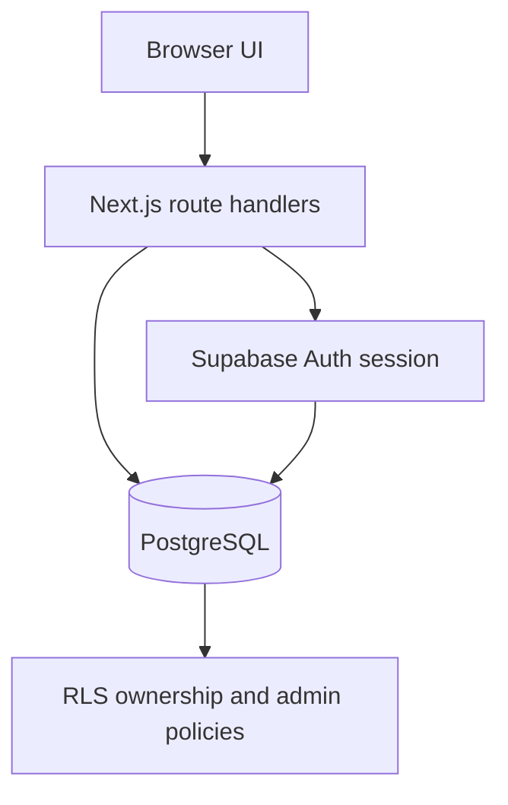

# Contour Mini-LMS

A focused consultation-management application built for the Contour Senior Software Engineer technical assessment. Students can authenticate, book and manage their own consultations. Administrators receive read-only visibility across the system.

## Delivered scope

- Email/password sign-up, confirmation, login, password recovery and logout
- Protected student dashboard
- Create, list, reschedule and cancel consultations
- Mark consultations complete or incomplete
- Admin-only, read-only list of all consultations
- PostgreSQL migrations, constraints, indexes and triggers
- Row Level Security (RLS) and role-based access control (RBAC)
- API validation and consistent error responses
- Unit tests, database policy tests and continuous integration

The interface intentionally stays simple because the assessment prioritises implementation, security and maintainability over custom visual design.

## Technology

- Next.js 16 App Router and React 19
- TypeScript in strict mode
- Supabase Auth, `supabase-js` and `supabase-ssr`
- PostgreSQL with RLS
- Zod request validation
- Tailwind CSS and shadcn/ui primitives
- Node test runner and pgTAP

## Architecture



The browser never receives a service-role key. Route handlers authenticate each request, validate its payload and make queries using the caller's session. PostgreSQL RLS independently enforces ownership or administrator visibility if an application check is missed.

Key directories:

```text
app/api/                         HTTP route handlers
app/protected/                   student route
app/admin/                       admin-only route
components/consultations/        student and admin interfaces
lib/consultations/               validation and state transitions
lib/supabase/                    browser/server Supabase clients
supabase/migrations/             versioned database schema
supabase/tests/database/         pgTAP security tests
tests/                           TypeScript unit tests
```

## Local setup

### Prerequisites

- Node.js 22 or newer
- npm
- Docker Desktop running
- Supabase CLI (the commands below can use `npx`)

### Start the project

```bash
git clone git@github.com:prazink/contour-mini-lms.git
cd contour-mini-lms
npm ci
npx supabase start
cp .env.example .env.local
```

Run `npx supabase status` and copy its local publishable key into `.env.local`. Keep the local URL as `http://127.0.0.1:54321`.

Apply the migrations and start Next.js:

```bash
npx supabase db reset
npm run dev
```

Open [http://localhost:3000](http://localhost:3000). Local confirmation emails are available in Mailpit at [http://127.0.0.1:54324](http://127.0.0.1:54324).

`supabase db reset` recreates the local database and removes local application data. Use it for initial setup or an intentional clean reset, not routine application startup.

### Create an administrator

New accounts always receive the `student` role. Role assignment is deliberately excluded from public application APIs to prevent privilege escalation. After creating and confirming an account, a trusted operator can promote it through the Supabase SQL editor:

```sql
update public.profiles
set role = 'admin'
where id = (
  select id
  from auth.users
  where email = 'admin@example.com'
);
```

An administrator is redirected from `/protected` to `/admin`. A student attempting to access `/admin` is redirected to `/protected`, and the admin API independently returns HTTP 403.

## API

| Method  | Endpoint                   | Access                | Purpose                                 |
| ------- | -------------------------- | --------------------- | --------------------------------------- |
| `GET`   | `/api/consultations`       | authenticated student | List the caller's consultations         |
| `POST`  | `/api/consultations`       | authenticated student | Book a consultation                     |
| `PATCH` | `/api/consultations/:id`   | owning student        | Reschedule, cancel or change completion |
| `GET`   | `/api/admin/consultations` | admin                 | List all consultations                  |

The PATCH endpoint accepts explicit operations instead of arbitrary database fields:

```json
{ "action": "reschedule", "scheduledAt": "2030-01-10T09:00:00.000Z" }
{ "action": "setCompletion", "completed": true }
{ "action": "cancel" }
```

This prevents mass assignment of fields such as `student_id` and keeps valid state transitions in one testable domain function.

## Data model and RBAC

`profiles` contains the authenticated user's application role: `student` or `admin`. `consultations` stores the four required booking fields, owner, status and audit timestamps.

Security rules include:

- every new user receives `student` by a database trigger
- students can read and create only their own consultations
- students can update only `scheduled_at` and `status`
- cancelled consultations cannot be changed or hard-deleted through the application role
- students cannot read another profile or promote their own role
- administrators can read every consultation but cannot modify student consultations
- anonymous users receive no table access

Both API checks and RLS are retained deliberately. API checks produce clear HTTP responses; RLS remains the database-level security boundary.

## Consultation lifecycle

- New consultations start as `scheduled`.
- A scheduled consultation may be rescheduled, completed or cancelled.
- A completed consultation may be marked incomplete, returning it to `scheduled`.
- Repeating the current completion value is idempotent.
- Cancellation is a terminal soft-delete state so administrative history is retained.
- The update query includes the expected current status. A concurrent state change therefore returns HTTP 409 rather than silently overwriting newer data.

Dates are submitted with an explicit timezone and stored as PostgreSQL `timestamptz`. The UI uses the browser's local timezone for display.

## Verification

Application checks:

```bash
npm run check
```

This runs ESLint, TypeScript, unit tests and a production build.

With local Supabase running:

```bash
npx supabase test db
npx supabase db lint
```

The pgTAP suite exercises student isolation, allowed mutations, blocked cross-user access, immutable cancellations, blocked role escalation, read-only administrator access and anonymous denial. Tests use fixed fixture identifiers and run in a rolled-back transaction, so they remain repeatable alongside existing local data.

CI runs the application and database suites independently on pushes to `main` and pull requests.

## Decisions, assumptions and trade-offs

### Route handlers over Server Actions

The brief prefers APIs. Route handlers make authentication, status codes, request contracts and future non-React clients explicit. Server Components remain useful for route-level authorization, while mutations use HTTP APIs.

### Database-backed roles

Roles live in `profiles`, not browser state or user-editable metadata. This provides a queryable source of truth protected by RLS. A larger system might place stable authorization claims in signed JWT custom claims to reduce role lookups, with a defined refresh and revocation strategy.

### Soft cancellation

Cancellation changes status rather than deleting the record. This preserves auditability and ensures the admin view reflects historical consultations. Permanent deletion and retention policies would need explicit business and privacy requirements.

### Names on each consultation

The brief explicitly requires first and last name for every booking, so they are stored as a snapshot on the consultation rather than inferred from the account. This permits a booking name to differ from a future profile name.

### Deliberately excluded

The application does not add tutor allocation, availability slots, notifications, search, pagination or audit-event tables because they are outside the requested scope. For larger data volumes, the admin endpoint would add cursor pagination and indexed filters instead of returning the complete dataset.

## Failure handling and production evolution

- Invalid JSON returns 400; validation failures return 422.
- Missing authentication returns 401 and insufficient role returns 403.
- Missing or non-owned resources return 404 without confirming another user's record exists.
- Invalid or concurrent state transitions return 409.
- Database details are logged server-side by error code and are not exposed to clients.
- Private API responses use `Cache-Control: private, no-store`.
- Baseline response headers prevent MIME sniffing, framing and unnecessary browser permissions.

For production scale, the next priorities would be cursor pagination, rate limiting at the edge, structured observability, audit events, time-slot conflict rules based on actual tutor capacity, end-to-end browser tests and deployment-specific Content Security Policy tuning.

## Hosted deployment outline

1. Create a hosted Supabase project.
2. Link the local CLI with `supabase link --project-ref <project-ref>`.
3. Apply migrations using `supabase db push`.
4. Configure `NEXT_PUBLIC_SUPABASE_URL` and `NEXT_PUBLIC_SUPABASE_PUBLISHABLE_KEY` in the hosting environment.
5. Add the deployed `/auth/confirm` URL to Supabase Auth redirect URLs.
6. Deploy the Next.js application and smoke-test both roles.

Only the publishable browser key belongs in the Next.js environment. A Supabase secret or service-role key is neither required nor used by this application.
